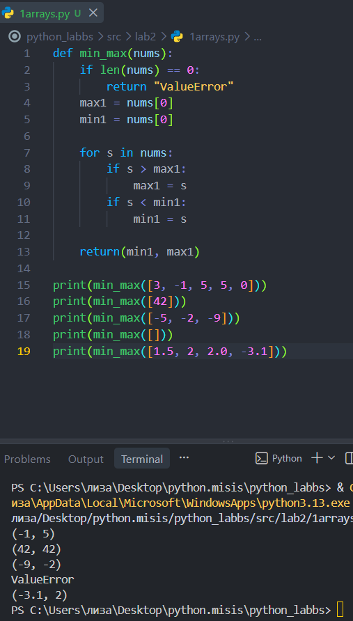
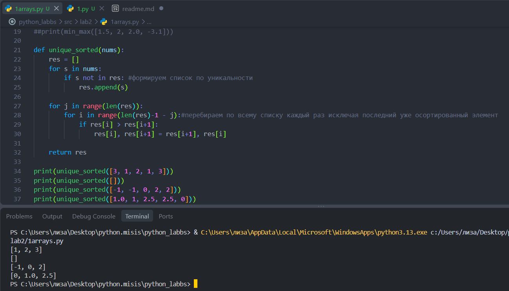
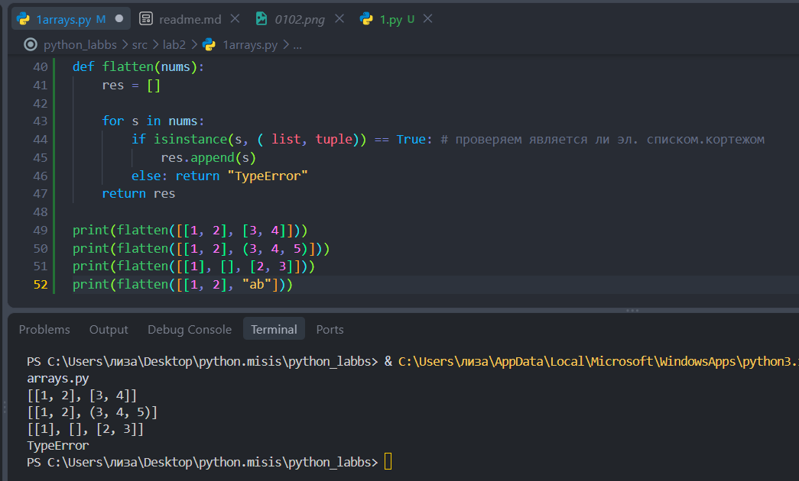
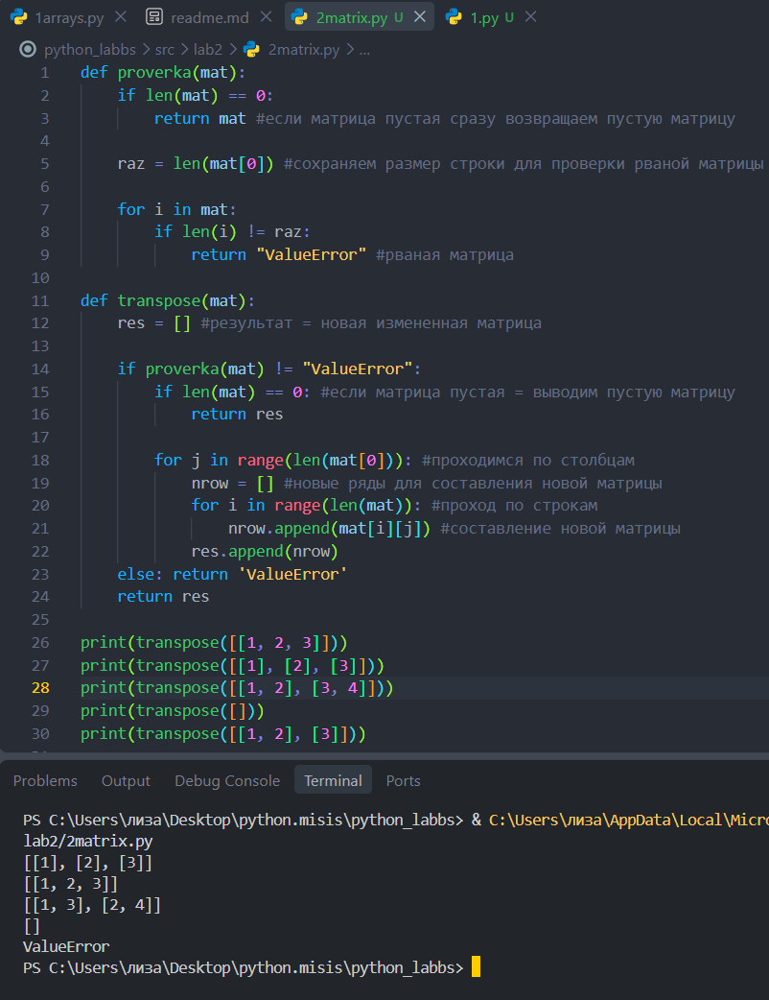
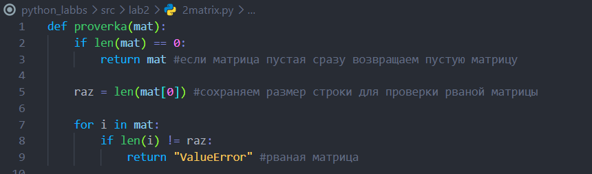
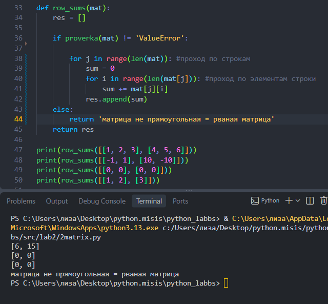
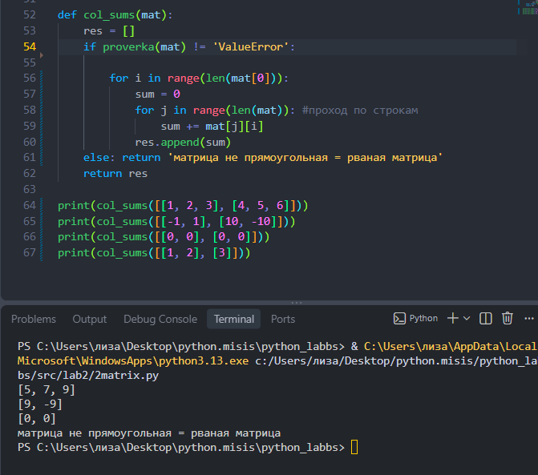
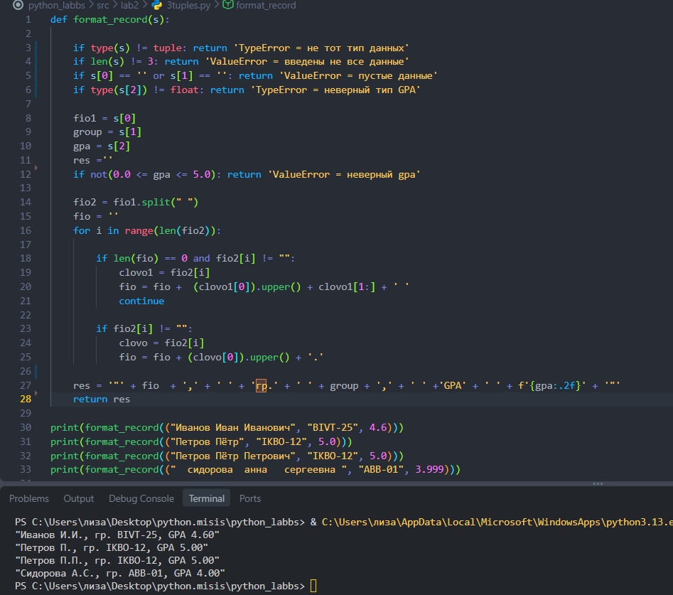

# ЛР2 — Коллекции и матрицы

## 1 задание — arrays.py

### Программа и запуск:

### (min_max)

### (unique_sorted)

### (flatten)

## 2 задание - Задание B — matrix.py

### (transpose)

### (row_sums)

### (col_sums)

## 3 задание - Задание C — tuples.py

