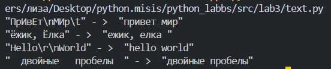
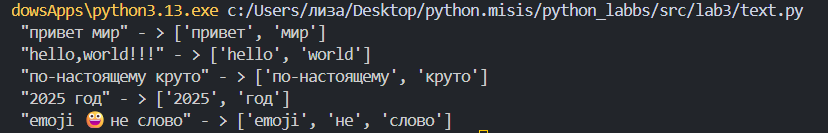
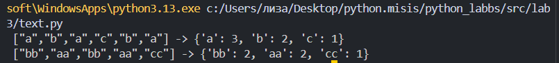
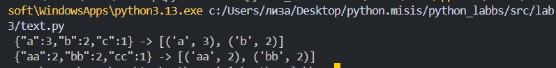

# ЛР3 — Тексты и частоты слов (словарь/множество)

## Задание A — `src/lib/text.py`

# **normalize**

```
def  normalize(text: str, *, casefold: bool = True, yo2e: bool = True):
    if casefold:
        text = text.casefold()
    else:
        text = text.lower()

    if yo2e:
        text = text.replace("ё", "е").replace("Ё","Е") #замена ёЁ на еЕ

    text = text.replace("\t", " ").replace("\r"," ").replace("\n"," ")

    return " ".join(text.split()) # "схлоп" пробелов

```

### **Тест-кейс**(normalize)


# **tokenize**

```
import re

def tokenize(text: str):
    return re.findall( r'\w+(?:-\w+)*', text) 
#сравнивает с шаблоном и возвращает список, нересекающийся с шаблоном

```

### **Тест-кейс**(tokenize)



## **count_freq**

```
def count_freq(tokens: list[str]):
    freq = {}

    for i in tokens:
        freq[i] = freq.get(i, 0) + 1 
        #смотрим ключ буквы, если его нет то заносим 1(если есть просто добавляем к значению 1)
    
    return freq
```
### **Тест-кейс**(count_freq)



## **top_n**

```
def top_n(dict, n): #на вход кортеж
    return sorted(dict.items(), key = lambda i : (-i[1], i[0]))[:n]
#через (items) делаем список и сортируем его по ключу -> делаем спец функцию чтобы сортировка была по убыванию

```
### **Тест-кейс**(count_freq)

