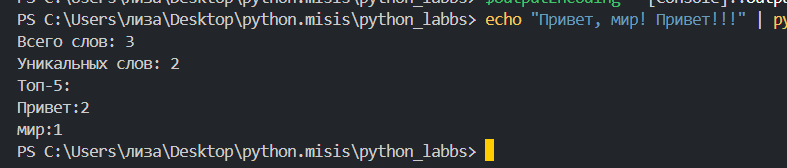
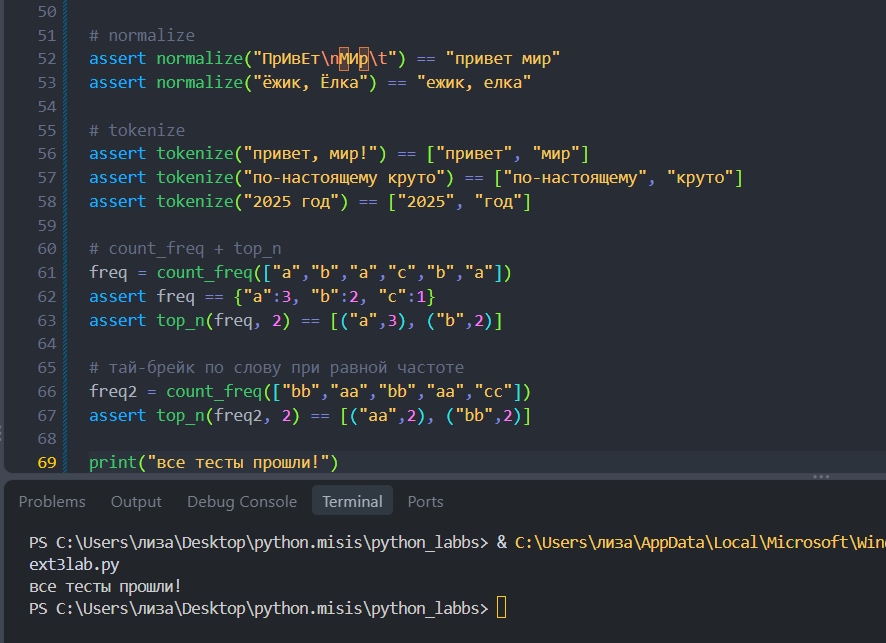

# ЛР3 — Тексты и частоты слов (словарь/множество)

## Задание A — `src/lib/text3lab.py`

 # 1. **`normalize`** 

```
def  normalize(text: str, *, casefold: bool = True, yo2e: bool = True):
    if casefold:
        text = text.casefold()
    else:
        text = text.lower()

    if yo2e:
        text = text.replace("ё", "е").replace("Ё","Е") #замена ёЁ на еЕ

    text = text.replace("\t", " ").replace("\r"," ").replace("\n"," ")

    return " ".join(text.split())

```
>`text = text.replace("ё", "е").replace("Ё","Е")` - > замена Ёё на Ее.

>*Схлоп* пробелов с помощью `return " ".join(text.split())`.

### **Тест-кейс**(normalize)


 # 2. **`tokenize`**

```
import re

def tokenize(text: str):
    return re.findall( r'\w+(?:-\w+)*', text) 
```
>Сравниваем с шаблоном и возвращаем список, непересекающийся с шаблоном

### **Тест-кейс**(tokenize)


 # 3. **`count_freq`**

```
def count_freq(tokens: list[str]):
    freq = {}

    for i in tokens:
        freq[i] = freq.get(i, 0) + 1 
    
    return freq
```
>Cмотрим ключ буквы, если его нет, то заносим 1(если есть просто добавляем к значению 1)
### **Тест-кейс**(count_freq)


 # 4. **`top_n`**

```
def top_n(dict, n): #на вход кортеж
    return sorted(dict.items(), key = lambda i : (-i[1], i[0]))[:n]
```
>Через `items` делаем список и сортируем его по ключу -> делаем спец функцию, чтобы сортировка была по убыванию
### **Тест-кейс**(count_freq)


## Задание B — `src/text_stats.py`

```
import sys
from pathlib import Path

sys.path.insert(0, str(Path(__file__).resolve().parent.parent))

from lib.text import tokenize, count_freq, top_n


def main():
    text = sys.stdin.read()
    words = tokenize(text)
    counts = count_freq(words)

    print(f"Всего слов: {len(words)}")
    print(f"Уникальных слов: {len(counts)}")
    print("Топ-5:")
    for word, n in top_n(counts, 5):
        print(f"{word}:{n}")


if __name__ == "__main__":
    main()
```
>Читаем весь ввод через `text = sys.stdin.read()`, затем преобразуем текст в список слов с помощью `words = tokentize(text)`, после преобразуем список в словарь через `counts = count_freq(words)`,чтобы найти значение количества тех или иных символов.
_______
```
for word, n in top_n(counts, 5):
        print(f"{word}:{n}")
```
>Через цикл перебираем пары из пяти самых частных и выводим `**слово : сколько раз встретилось**`
____________________________________________________________________
```
if __name__ == "__main__":
    main()
```
>Проверяем, что файл запущен напрямую и запускаем программу.

### **Запуск**



### **Контрольные мини-тесты**



